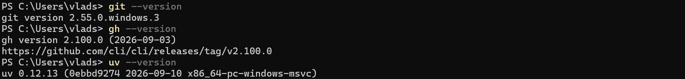
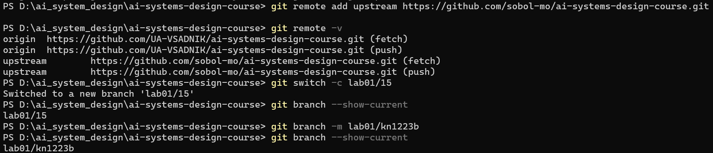
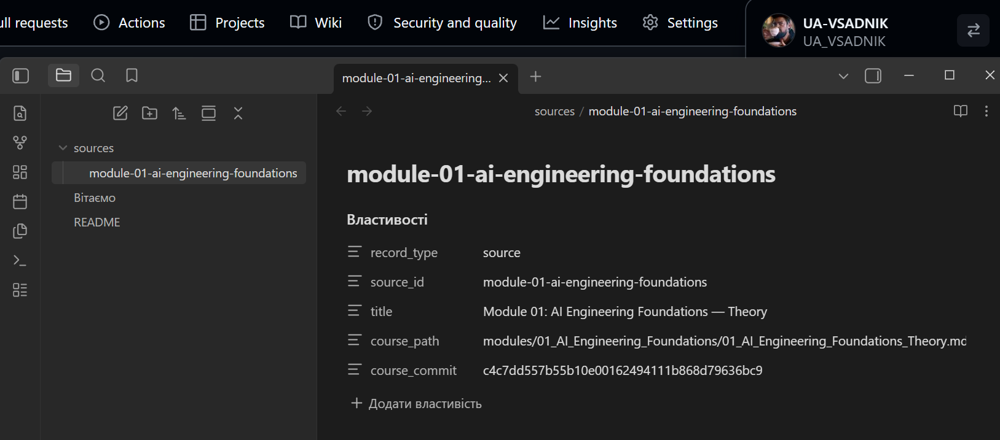
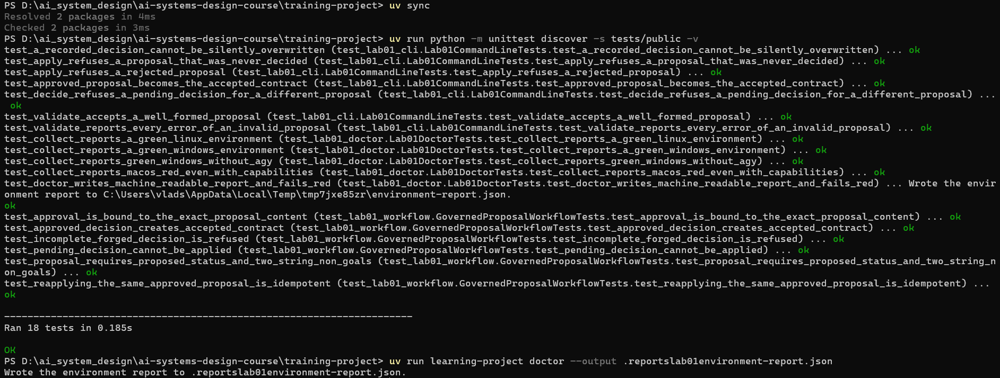
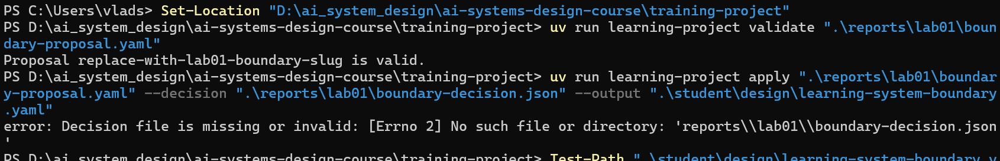
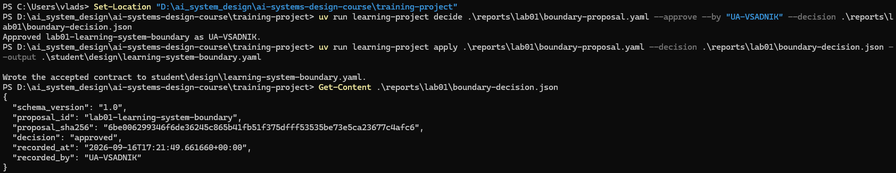

# Лабораторна робота 01

## Ідентифікація подання

* URL форку: `https://github.com/UA-VSADNIK/ai-systems-design-course.git`
* Назва гілки: `lab01/kn1223b`
* Повний хеш коміту: `fc4068c2a88fb28081b76580519fcba8098ab583`

## Середовище

Перед виконанням лабораторної роботи було перевірено готовність робочої станції. Використовувалася операційна система Windows 11. На початковому етапі було перевірено доступність PowerShell, Git, WinGet та можливість використання команди `winget configure`.

Конфігурацію робочої станції було застосовано двічі командою `winget configure`. Під час першого застосування необхідні компоненти були приведені до заданого стану. Повторне застосування завершилося без помилок і без необхідності повторного встановлення вже налаштованих компонентів, що підтвердило збіжність конфігурації.

У результаті перевірки були доступні необхідні інструменти: Git, GitHub CLI, `uv` та Obsidian. Результати перевірки середовища також були зафіксовані у `environment-report.json`.



Рисунок — `02-workstation-capabilities.png`

## Власність репозиторію

Репозиторій курсу було отримано через власний GitHub-форк. Локальна копія розміщена у робочій директорії `D:\ai_system_design\ai-systems-design-course`.

Віддалений репозиторій `origin` вказує на особистий форк `UA-VSADNIK/ai-systems-design-course`, а `upstream` — на основний репозиторій курсу `sobol-mo/ai-systems-design-course`. Для виконання лабораторної роботи створено особисту робочу гілку `lab01/kn1223b`.

Таким чином, зміни студента відокремлені від основного репозиторію курсу, а оновлення навчальних матеріалів можуть отримуватися з `upstream`.



Рисунок — `01-git-remotes.png`

## Зовнішнє сховище Markdown-файлів

Окреме Markdown-сховище було створено як `external to repository`, тобто поза межами Git-репозиторію курсу. У ньому створено файл `README.md`, який визначає сховище як канонічний навчальний стан під контролем студента.

У сховищі також зареєстровано джерело теорії Модуля 01. Для цього створено файл `sources/module-01-ai-engineering-foundations.md` із YAML-передмовою, що містить ідентифікатор джерела, назву, шлях до матеріалу курсу та хеш коміту, з якого було отримано теоретичний матеріал.

Після початкового створення сховище було переміщене до OneDrive, що забезпечує наявність копії навчального стану поза локальним пристроєм. При цьому сховище залишається окремим від Git-репозиторію.



Рисунок — `05-external-vault.png`

## Шлях пропонувача

Для цього етапу було використано задокументований ручний запасний шлях без агента. Придатний агентський доступ для виконання завдання локально був недоступний, тому неіснуючий сеанс ШІ-агента не створювався і не імітувався.

Поточний кандидат пропозиції був підготовлений студентом вручну на основі теоретичних матеріалів Модуля 01 та наданих вимог до системи. При цьому запланований розподіл повноважень не змінювався: пропозиція проходить детерміновану перевірку, а остаточне рішення про її прийняття залишається за людиною.

Окреме очищене свідчення невдалого запуску агента не використовувалося, тому окремий знімок агентського сеансу до звіту не додається.

Для ручного запасного шляху підтвердженням є опис виконаних дій, подальший `validate`, семантичний розгляд, `decide` та `apply`.

## Семантичний розгляд

Семантичний розгляд було виконано до запуску `decide`.

1. **Чи зберігає пропозиція надану навчальну систему знань, а `personal_domain` використовується лише для можливого пізнішого обмеженого розширення?**

   **Відповідь:** Так. Пропозиція зберігає основну ідентичність навчальної системи знань. `personal_domain: software-engineering` використовується лише як можливе майбутнє розширення і не змінює межі ядра системи.

2. **Чи описує запланований навчальний результат спостережувану здатність студента, а не «використати ШІ»?**

   **Відповідь:** Так. `intended_learning_outcome` описує здатність студента створювати та підтримувати доказову технічну базу знань, працювати із зареєстрованими джерелами, визначати зв'язки та фіксувати невирішені питання. Сам факт використання ШІ не є навчальним результатом.

3. **Чи запобігають нецілі розширенню до повної системи в промисловій експлуатації або процесу рішень із високими наслідками?**

   **Відповідь:** Так. `non_goals` обмежують систему щодо приватних даних, облікових даних, секретів та автономного прийняття критично важливих рішень. Також виключено медичні, фінансові, юридичні та безпекові рішення з високими наслідками.

4. **Чи обмежує розподіл обов'язків ШІ пропонуванням, призначає структурне забезпечення детермінованому робочому процесу та зберігає повноваження затверджувати зміни за студентом?**

   **Відповідь:** Так. ШІ у запланованій системі має роль пропонування інтерпретацій, зв'язків, неоднозначностей та відкритих питань. Детермінований процес відповідає за перевірку кандидата та його застосування лише після наявності людського рішення. Студент має повноваження схвалити або відхилити пропозицію. У поточному ручному сценарії кандидат був підготовлений студентом, тому авторство неіснуючого агентського сеансу не заявляється.

5. **Чи можна перевірити умову корисності на збережених свідченнях джерел?**

   **Відповідь:** Так. Умова корисності сформульована як властивість повного робочого процесу: прийняті зміни повинні бути простежуваними до джерела та рішення про затвердження, а канонічний стан має залишатися відтворюваним. Її повна перевірка належить до подальшого виконання відповідного циклу workflow.

6. **Чи описує ризик правдоподібну відмову повного робочого процесу?**

   **Відповідь:** Так. Визначено ризик прийняття студентом правдоподібної, але неправильної пропозиції, що може призвести до потрапляння непідтвердженої інформації до канонічного стану. Саме тому перед застосуванням передбачено людський перегляд.

7. **Чи є базова лінія без ШІ справді простішою і здатною закрити частину результату?**

   **Відповідь:** Так. Базовою лінією є ручна робота студента із зареєстрованими джерелами та Markdown-сховищем без використання ШІ. Вона може забезпечувати базовий навчальний результат, але всі операції з аналізу та підготовки пропозицій виконуються вручну.

8. **Чи охоплюють пункти потрібних свідчень як детерміновану поведінку, так і семантичний розгляд або розгляд обґрунтування джерелами?**

   **Відповідь:** Так. `required_evidence` передбачає збереження результату детермінованої перевірки, людського семантичного розгляду та рішення, пов'язаного з конкретним `proposal_id` і SHA-256 дайджестом пропозиції.

9. **Чи ідентифікує невизначеність те, що ще не встановлено?**

   **Відповідь:** Так. У полі `uncertainty` зафіксовано, що ще не встановлено, наскільки використання ШІ покращить навчальний результат порівняно з ручною базовою лінією та чи вдасться зберегти необхідну якість людського розгляду і доказової бази.

**Висновок:** за результатами семантичного розгляду пропозиція узгоджується з визначеною ідентичністю навчальної системи, її нецілями, розподілом повноважень та вимогами до доказовості. Після завершення цього розгляду пропозицію було передано на формальне людське рішення.

## Розподіл повноважень

У звичайній системі ШІ має повноваження пропонувати зміни, але не затверджувати їх. Це дозволяє використовувати ШІ для аналізу матеріалів, пошуку зв'язків, формування кандидатів і виявлення неоднозначностей, не передаючи йому контроль над канонічним станом системи.

Детермінований код виконує перевірку структури та контролює умови застосування. Людина залишається відповідальною за семантичний розгляд і остаточне рішення.

У використаному ручному запасному шляху поточний кандидат був написаний студентом. Це є авторством конкретної пропозиції, а не зміною запланованої архітектурної межі: навіть за ручного виконання затвердження відбувається через окреме людське рішення `decide`, після якого `apply` створює прийнятий контракт.

## Корисність і базова лінія без ШІ

ШІ може бути корисним для пошуку зв'язків між навчальними матеріалами, формування кандидатів змін, виявлення неоднозначностей і підготовки пропозицій для подальшого людського розгляду.

Простіша базова лінія без ШІ вже здатна забезпечити основну частину навчального результату. У такому варіанті студент самостійно працює із зареєстрованими джерелами, створює Markdown-нотатки, визначає концепції та зв'язки і перевіряє зміни вручну.

Отже, використання ШІ є потенційним засобом підвищення зручності та швидкості роботи, а не обов'язковою умовою існування навчальної системи.

## Особиста предметна сфера як пізніше розширення

У пропозиції як `personal_domain` визначено `software-engineering`. Це поле розглядається лише як можливий напрямок майбутнього розширення і не змінює призначення поточної навчальної системи.

Поточний навчальний результат залишається пов'язаним із побудовою та підтримкою доказової бази знань. Додавання предметної сфери в майбутньому не повинно змінювати зафіксовану межу системи без окремого перегляду та відповідного людського рішення.

## Проєктний компроміс

Основним компромісом є співвідношення між корисністю та ризиком. Використання ШІ може скоротити ручну роботу з аналізу джерел і підготовки кандидатів, але водночас створює ризик отримання правдоподібної, але неправильної пропозиції.

Тому система не передає ШІ право змінювати канонічний стан. Додатковий людський розгляд збільшує затримку процесу, але забезпечує контроль над прийняттям змін і зменшує ризик автоматичного потрапляння неперевіреної інформації до навчальної бази знань.

## Детерміновані перевірки

Публічні тести було виконано командою:

```powershell
uv run python -m unittest discover -s tests/public -v
```

У результаті всі 18 тестів завершилися зі статусом `ok`.



Рисунок — `03-public-tests.png`

Після цього було виконано структурну перевірку пропозиції:

```powershell
uv run learning-project validate .\reports\lab01\boundary-proposal.yaml
```

Вона завершилася повідомленням:

```text
Proposal lab01-learning-system-boundary is valid.
```

До наявності людського рішення була виконана спроба передчасного `apply`. Вона була відхилена через відсутність коректного файлу рішення `boundary-decision.json`. Таким чином, система не застосувала пропозицію автоматично лише після успішної структурної перевірки.



Рисунок — `06-premature-apply-refused.png`

Після завершення семантичного розгляду було виконано `decide` з людським схваленням. Файл `boundary-decision.json` зафіксував рішення `approved`, ідентифікатор особи, яка прийняла рішення, та SHA-256 хеш пропозиції.

Після цього команда `apply` успішно створила прийнятий контракт:

```text
student/design/learning-system-boundary.yaml
```



Рисунок — `07-accepted-contract.png`

Водночас успішна структурна перевірка не доводить, що пропозиція є якісним проєктом системи. Валідатор перевіряє визначені формальні умови та структуру даних. Питання відповідності навчальній меті, межам системи, ризикам, базовій лінії та розподілу повноважень потребують окремого семантичного людського розгляду.

## Відновлення

Для відновлення робочого середовища необхідно мати доступ до репозиторію курсу та студентського форку, перейти до `training-project` і виконати синхронізацію залежностей за допомогою `uv sync`. Стан робочої станції може бути відтворений через конфігурацію Windows, а коректність інструментів перевіряється засобом `learning-project doctor`.

Артефакти проєкту зберігаються у Git. До них належать `student/design/learning-system-boundary.yaml`, матеріали `reports/lab01/`, файл пропозиції `boundary-proposal.yaml`, людське рішення `boundary-decision.json`, звіт середовища `environment-report.json` та журнал `provision.log`.

Зовнішнє Markdown-сховище відновлюється окремо від Git-репозиторію. Воно містить `README.md` та зареєстровані джерела навчальних матеріалів. На момент завершення роботи сховище має копію поза локальним пристроєм у OneDrive, тому його стан не залежить виключно від робочої копії на комп'ютері.
