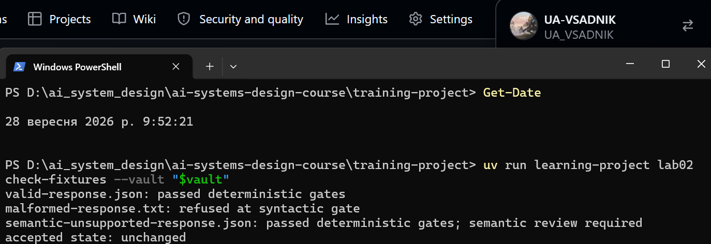
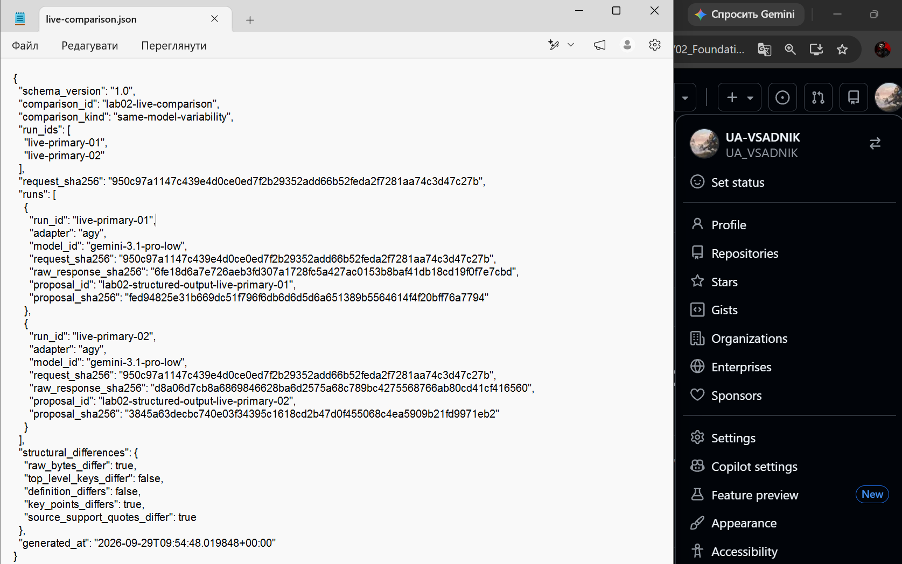
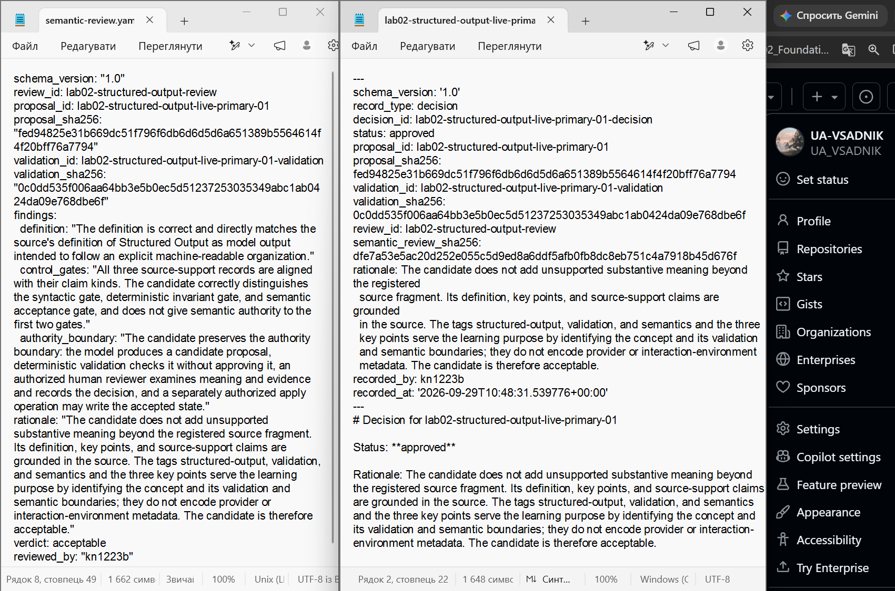
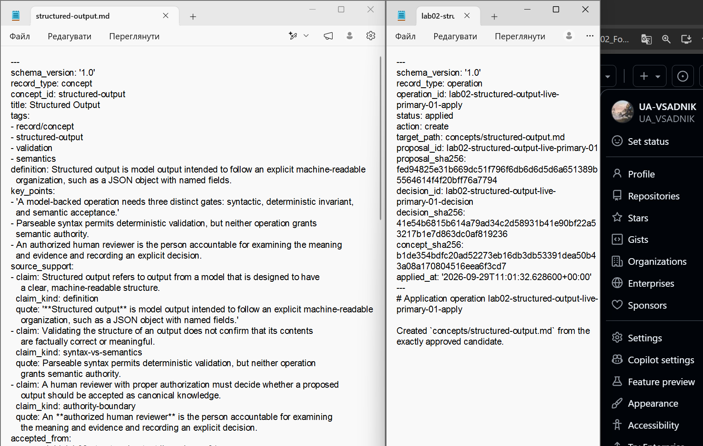
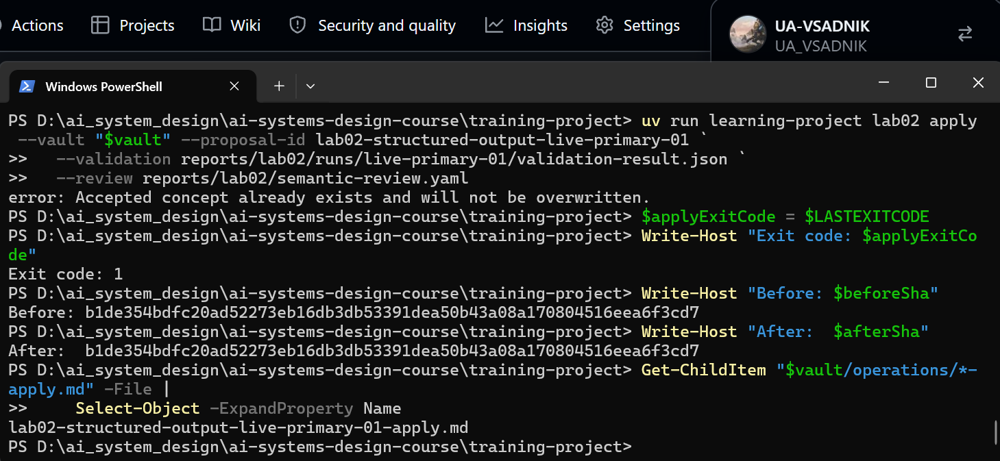
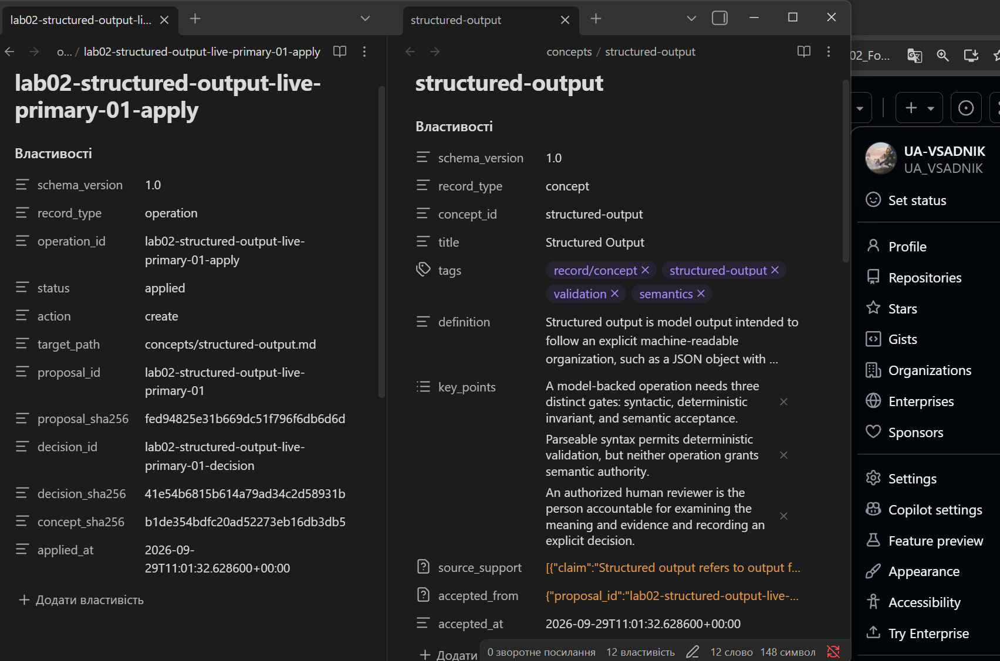

# Лабораторна робота 02

У лабораторній роботі було перевірено процес підготовки структурованої пропозиції знань із використанням моделі, детермінованої перевірки та окремого людського семантичного контролю. Основна мета роботи — показати, що коректна структура відповіді не означає автоматичного семантичного схвалення, а зміна канонічного стану виконується лише після явного рішення уповноваженої людини.

## Ідентифікація подання

- URL форку: https://github.com/UA-VSADNIK/ai-systems-design-course
- Назва особистої гілки: `lab02/kn1223b`
- Повний хеш коміту зі свідченнями:

## Початковий стан і реєстрація джерела

На початку роботи було синхронізовано форк із вихідним репозиторієм курсу та створено особисту гілку `lab02/kn1223b`. Робота виконувалася у каталозі `training-project`, а зовнішнє сховище знань використовувалося окремо від Git-репозиторію курсу.

Для лабораторної роботи було зареєстровано точний фрагмент теорії модуля 02 про Structured Output. Фрагмент має ідентифікатор `module-02-1-3-structured-output-controls-v1` та окремий SHA-256.

`course_commit` у реєстрації джерела означає базовий стан матеріалів курсу, з якого було взято теоретичний фрагмент. Він не є комітом мого подання, оскільки коміт подання створюється пізніше і містить результати виконання лабораторної роботи.

## Детерміновані шлюзи

На першому етапі було перевірено три тестові фікстури: коректну, пошкоджену та семантично непридатну.

Коректна фікстура проходить синтаксичний шлюз і перевірку детермінованих інваріантів. Пошкоджена фікстура не проходить перевірку структури. Семантично непридатна фікстура може мати правильний формат і потрібні поля, але це саме по собі не робить її зміст правильним.

Це показує різницю між синтаксичною коректністю, детермінованими обмеженнями та семантичним прийняттям. Схема може перевірити форму даних, типи, обов'язкові поля та допустимі значення, але не може самостійно встановити, чи правильно модель зрозуміла джерело.

Рисунок — `01-offline-gates.png`

## Живі запуски та порівняння

Для першого живого запуску `live-primary-01` було використано адаптер `agy` і модель `gemini-3.1-pro-low`. Для другого живого запуску `live-primary-02` також було використано адаптер `agy` і модель `gemini-3.1-pro-low`. Обидва запуски виконувалися з одним і тим самим запитом.

Порівняння має класифікацію `same-model-variability`. Вона випливає з метаданих двох запусків: адаптер і модель у них однакові. Тому це не `fallback-portability`, яка була б доречною при порівнянні різних постачальників або адаптерів.

У двох запусків відрізнялися SHA-256 сирих відповідей: для `live-primary-01` було зафіксовано `6fe18d6a7e726aeb3fd307a1728fc5a427ac0153b8baf41db18cd19f0f7e7cbd`, а для другого живого запуску було отримано іншу сиру відповідь. Отже, відповіді на рівні сирого результату не були побітово однаковими. Сам факт цієї різниці не доводить, що її причиною була саме вибірка моделі або інший окремий фактор.

Для виконання лабораторної роботи не було потрібно створювати додатковий запуск лише для отримання ще однієї відмінності.

Рисунок — `03-live-comparison.png`

## Семантична коректність і повноваження

Успішний `validate` означає, що кандидат відповідає заданій структурі та детермінованим інваріантам. Це не означає, що всі твердження кандидата правильно передають зміст джерела.

Так само схема структурованого виводу на стороні постачальника контролює формат відповіді, але не встановлює істинність або правильність її змісту. Модель створює кандидатську пропозицію, а не канонічне знання.

Повноваження прийняти або відхилити кандидата має уповноважений людський рецензент. У межах цієї лабораторної роботи цю роль виконує студент. Детермінований код перевіряє кандидат, але не приймає семантичного рішення. Операція `apply` також не повинна самостійно визначати змістовну правильність: вона лише виконує вже схвалене рішення за умови виконання встановлених перевірок.

## Семантичний розгляд і рішення

Для `live-primary-01` було проведено семантичний розгляд. Вердикт становить `acceptable`.

Визначення Structured Output відповідає зареєстрованому фрагменту джерела. Три записи `source_support` відповідають визначеним типам тверджень: визначенню, розмежуванню синтаксису та семантики і межі повноважень. Ключові пункти також правильно відображають три шлюзи та роль людського рішення.

Кандидат не додає непідтриманого змісту, який суперечив би зареєстрованому джерелу. Тому було прийнято рішення `approved` для конкретного кандидата `lab02-structured-output-live-primary-01`.

Рішення прив'язане до точного SHA-256 пропозиції та результату її перевірки. SHA пропозиції: `fed94825e31b669dc51f796f6db6d6d5d6a651389b5564614f4f20bff76a7794`. SHA результату перевірки: `0c0dd535f006aa64bb3e5b0ec5d51237253035349abc1ab0424da09e768dbe6f`.

Рисунок — `04-review-decision.png`

## Прив’язки SHA-256

SHA-256 у цій роботі використовується для прив'язування конкретних версій артефактів.

Реєстрація джерела та його фрагмента дозволяє пов'язати використаний теоретичний матеріал із конкретними даними джерела.

Метадані живого запуску містять SHA запиту та сирої відповіді. Це дозволяє пов'язати зафіксований запуск із конкретними вхідними та вихідними даними.

SHA пропозиції пов'язує semantic review та рішення з конкретною версією файлу пропозиції. SHA validation пов'язує рішення з конкретним результатом детермінованої перевірки.

Після семантичного розгляду рішення містить SHA самого розгляду. Це не дозволяє непомітно замінити розгляд після прийняття рішення.

Під час застосування прийняте поняття містить `accepted_from`, завдяки чому канонічний стан пов'язаний із конкретною прийнятою пропозицією та рішенням.

Водночас SHA-256 не доводить авторство відповіді зовнішньою моделлю та не доводить семантичну правильність даних. Дайджест підтверджує відповідність конкретному набору байтів, але не встановлює істинність їхнього змісту.

## Контрольоване застосування

Після успішного семантичного розгляду було зафіксовано рішення `approved`, після чого виконано `apply` для `lab02-structured-output-live-primary-01`.

Операція успішно створила канонічне поняття `concepts/structured-output.md` та один відповідний запис операції `operations/lab02-structured-output-live-primary-01-apply.md`.

Запис прийнятого поняття містить `accepted_from`, який пов'язує результат із конкретною пропозицією та рішенням. Таким чином, канонічний стан було створено не безпосередньо відповіддю моделі, а лише після проходження детермінованої перевірки, семантичного розгляду та явного схвалення.

Рисунок — `05-controlled-apply.png`

## Відмова без зміни прийнятого стану

Після успішного застосування ту саму команду `apply` було запущено повторно. Команда завершилася з кодом виходу `1`, оскільки цільове поняття `concepts/structured-output.md` уже існувало.

До та після відмови було обчислено SHA-256 канонічного поняття. Дайджести виявилися однаковими, тому вміст прийнятого поняття не змінився.

Кількість успішних записів операції також залишилася рівною одному. Отже, повторна спроба не створила другого запису `*-apply.md` і не змінила вже прийнятий стан.

Рисунок — `02-refusal-unchanged.png`

## Проєктний компроміс

У цьому процесі можна зменшити витрати на модель, використовуючи дешевший або доступніший модельний маршрут, але тоді важливішими стають детерміновані перевірки та людський контроль. З іншого боку, складніша модель може давати якісніші кандидатські відповіді, але її використання може бути дорожчим і все одно не усуває необхідності перевіряти семантику.

Використання одного адаптера і моделі для двох живих запусків дозволило перевірити мінливість результатів без зміни постачальника. Детерміновані шлюзи додали обчислювальні витрати, але дали можливість автоматично відсікати структурно неправильні кандидати. Людський семантичний контроль залишився необхідним для частини, яку не можна надійно визначити лише схемою.

## Захист облікових і платіжних даних

Облікові дані не включалися до аргументів команд, Git-комітів, звіту або збережених доказів лабораторної роботи. У свідченнях зберігалися лише необхідні ідентифікатори запусків, хеші, результати перевірок і метадані.

У цій роботі фактичне живе генерування виконувалося через AGY, тому запасний маршрут OpenRouter для отримання живої відповіді не використовувався. Відповідно, перевірка платіжної картки на стороні OpenRouter у межах виконаного сценарію не проводилася.

Жодні дані платіжної картки не використовувалися та не повинні потрапляти до репозиторію, звіту або доказів.

## Канонічний, аудиторський і похідний стан

Канонічним прийнятим знанням є: `concepts/structured-output.md`

Незмінними свідченнями запусків і аудиту є збережені файли живих запусків, зокрема `model-request.json`, `raw-response.txt`, `run-metadata.json` і `validation-result.json`, а також proposal у зовнішньому сховищі, semantic review, decision та apply operation.

До аудиторського ланцюга також належать файли:

* `reports/lab02/semantic-review.yaml`;
* `decisions/lab02-structured-output-live-primary-01-decision.md`;
* `operations/lab02-structured-output-live-primary-01-apply.md`;
* файли запусків `live-primary-01` та `live-primary-02`.

Похідними результатами є порівняння живих запусків, результати перевірок і звітні матеріали, які можна повторно побудувати з незмінних свідчень. Вони не є заміною канонічного поняття.

## Остаточна перевірка

На кроці 12 буде виконано `lab02 verify`. Перед цією перевіркою хеш коміту зі свідченнями у цьому звіті залишається порожнім, оскільки коміт ще не створено.

Остаточна перевірка має підтвердити, що всі необхідні артефакти лабораторної роботи існують, їхні посилання та імена відповідають контракту, а прийняте поняття присутнє в очікуваному канонічному місці.

Ця перевірка підтверджує відповідність збережених артефактів і структури роботи встановленим вимогам. Вона не доводить семантичну істинність знання незалежно від джерела та не є доказом авторства зовнішньої моделі.

Рисунок — `06-final-result.png`
